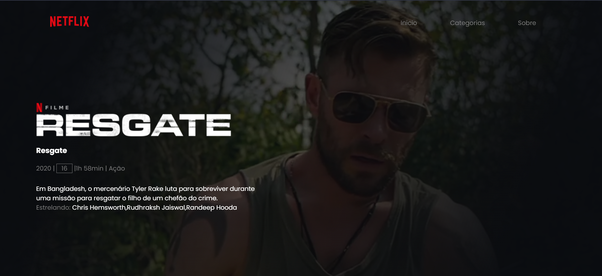

<h1 align="center">
  Reconstrução da pagina do filme Resgate
</h1>

  

## 💻 Projeto

Este projeto é uma recostrução da pagina do filme **Resgate** presente na Netflix usando  _HTML_ e _CSS_.

## 🚀 Tecnologias

- HTML
- CSS
## 📔 Conhecimentos abordados

- [x] Uso semântico do HTML
- [x] Carregamento de video no background
- [x] Váriaveis do css no `:root`
